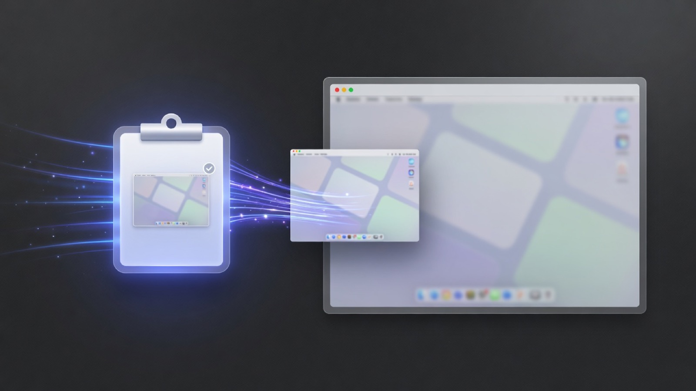

# clipboard-screenshot

<p align="center">
  
</p>

**New macOS screenshots land on your clipboard automatically.** Files stay where macOS saved them (Desktop by default). No archive folder, no cloud, no Homebrew.

`⌘⇧3` / `⌘⇧4` → `⌘V`

## Why this exists

macOS can save screenshots to a file **or** the clipboard (`⌘⌃⇧3` / `⌘⌃⇧4`) — not both. This tool watches for new screenshot files and copies them to the pasteboard so you still get a Desktop file **and** an instant paste.

Zero dependencies: `launchd`, `zsh`, and `osascript` only.

## Install

```bash
git clone https://github.com/stevederico/clipboard-screenshot.git
cd clipboard-screenshot
./install.sh
```

If macOS asks to allow **Clipboard Screenshot → System Events**, click **OK** (needed to list Desktop under TCC).

### What install does

| Action | Detail |
|---|---|
| Launch agent | `com.stevederico.clipboard-screenshot` via `WatchPaths` on your screenshot folder |
| App name | **Clipboard Screenshot** (not “zsh” in Login Items) |
| Floating thumbnail | **Turned off** so the PNG is written immediately (see below) |
| Screenshot location | **Unchanged** — still Desktop (or whatever you set) |
| Files | **Not moved** — stay where macOS put them |

### Uninstall

```bash
./uninstall.sh
```

Removes the agent and support files; restores your previous floating-thumbnail setting. Does not delete Desktop screenshots.

## How it works

1. **launchd `WatchPaths`** — FSEvents-backed. Kernel notifies when your screenshot folder changes. No poll loop.
2. **System Events** lists the newest `Screenshot*` file (launchd cannot `readdir` Desktop under TCC).
3. Waits until the file is **newer than the last copy** and size-stable (avoids pasting the previous shot).
4. Copies PNG to the general pasteboard via JXA/`osascript`.
5. Optional notification: **Screenshot Ready**.

### Floating thumbnail

The bottom-right screenshot preview **defers writing the file to disk** until it dismisses. There is no public API for that in-memory preview, so install disables `show-thumbnail`. Uninstall restores your prior setting.

```bash
# re-enable manually if you want
defaults write com.apple.screencapture show-thumbnail -bool true
killall SystemUIServer   # or log out/in
```

## Control

```bash
# Logs
tail -f ~/Library/Application\ Support/com.stevederico.clipboard-screenshot/watcher.log

# Stop
launchctl bootout gui/$(id -u)/com.stevederico.clipboard-screenshot

# Start again
cd clipboard-screenshot && ./install.sh
```

Support files live under:

```text
~/Library/Application Support/com.stevederico.clipboard-screenshot/
```

## Requirements

- macOS (tested on Sequoia)
- Automation permission for System Events when prompted
- Default screenshot names (`Screenshot …` / `Screen Shot …`)

## Not this tool

| Want | Use instead |
|---|---|
| Clipboard only, no file | `⌘⌃⇧3` / `⌘⌃⇧4` (built-in) |
| Move/archive off Desktop | Not in scope — this leaves files put |
| Cross-platform | macOS only |

## License

[MIT](LICENSE) © Steve Derico
